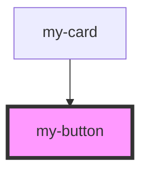

# my-button

<!-- Auto Generated Below -->

## Properties

| Property | Attribute | Description | Type     | Default       |
| -------- | --------- | ----------- | -------- | ------------- |
| `label`  | `label`   |             | `string` | `'Click me!'` |

## Events

| Event | Description | Type                |
| ----- | ----------- | ------------------- |
| `tap` |             | `CustomEvent<void>` |

## Dependencies

### Used by

 - [my-card](../my-card)

### Graph

----------------------------------------------

*Built with [StencilJS](https://stenciljs.com/)*
