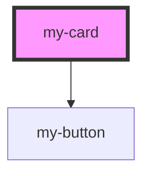

# my-card

<!-- Auto Generated Below -->

## Properties

| Property    | Attribute    | Description | Type     | Default     |
| ----------- | ------------ | ----------- | -------- | ----------- |
| `content`   | `content`    |             | `string` | `undefined` |
| `titleCard` | `title-card` |             | `string` | `undefined` |

## Dependencies

### Depends on

- [my-button](../my-button)

### Graph

----------------------------------------------

*Built with [StencilJS](https://stenciljs.com/)*
